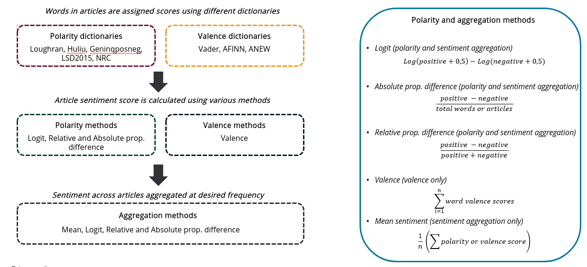

```{r setup, include=FALSE}
knitr::opts_chunk$set(
   echo = TRUE, 
   comment=NA,
   eval = FALSE, 
   fig.path = "man/figures/")

# options(tibble.width = Inf)
# pkgdown::build_site()
# VAR Example  https://towardsdatascience.com/a-deep-dive-on-vector-autoregression-in-r-58767ebb3f06
```

# sententia 

[](https://www.tidyverse.org/lifecycle/#experimental)
[](https://github.com/71point4/sententia/commits/develop)

[Sententia](https://github.com/71point4/sententia) provides access to media sentiment data from the Bureau for Economic research.

This is the homepage for the {sententia} R package is at <https://github.com/71point4/sententia>.

The homepage for the {sententia} `python` package is at <https://github.com/71point4/pysententia>.

## Installation

Install from GitHub.

```{r eval=FALSE}
remotes::install_github("71point4/sententia")
```

If you want availability to the latest features (at your own risk) then you can also install from the development branch.

```{r eval=FALSE}
remotes::install_github("71point4/sententia", ref = "dev")
```

## Usage

```{r load-package, eval = TRUE}
library(sententia)
```

Check version.

```{r check-version}
packageVersion("sententia")
```

### Set API Key

To access the API you'll need to first specify an API key as provided to you by the BER.

```{r eval=FALSE}
# Example API key (this key will not work).
set_api_key("7b58ffa5afcf893d678433a56e0edca5")
get_api_key()
```

```{r include=FALSE}
set_api_key(Sys.getenv("SENTENTIA_KEY"))
```

If you wish not to set the key every time, use `usethis::edit_r_environ()` to set the key to `SENTENTIA_KEY`.

Please be aware, that there is an order where the API looks for keys:

1) Look for `ENV` variable, `SENTENTIA_KEY`, if not found, look in `cache` where key was stored using `set_api_key()`
3) `set_api_key()` OVERRIDES `SENTENTIA_KEY` in `.Renviron`!

To obtain a key, please get in touch. Contact details are in `DESCRIPTION`.

# The API interface

Besides providing sentiment calculations from different word-list dictionaries, the API interface provides access to the various permutations that is available in calculating a sentiment score (Within text and across time): 

```{r, eval = TRUE, echo = FALSE, fig.align='center'}

```

* Sentiment calculation `WITHIN` the article
   - In the API this is set by the `aggr` parameter
* Sentiment calculation `ACCROSS` a time period
   - This does not need to be set. API returns four aggregations:
      - `mean_sentiment` 
      - `relative` 
      - `absolute` 
      - `sent_log`

## Sentiment Index

Get media sentiment index values for specified media source, model, topic, dictionary, frequency, and aggregation method combination.

```{r}
sent_index(
   source = "businessday",
   model = "model_2021-05-15",
   topic = "global",
   freq = "day",
   dict = "loughran",
   aggr = "sent_logit"
   )

# # A tibble: 224 × 9
#    source      published_date dict_name type     aggr_type  mean_sentiment relative absolute sent_log
#    <chr>       <chr>          <chr>     <chr>    <chr>               <dbl>    <dbl>    <dbl>    <dbl>
#  1 businessday 2003-01-01     loughran  polarity sent_logit         -1.80    -1       -1        0    
#  2 businessday 2003-02-01     loughran  polarity sent_logit         -0.784   -0.639   -0.576   -0.645
#  3 businessday 2003-03-01     loughran  polarity sent_logit         -0.768   -0.539   -0.505   -0.523
#  4 businessday 2003-04-01     loughran  polarity sent_logit         -0.604   -0.423   -0.420   -0.388
#  5 businessday 2003-05-01     loughran  polarity sent_logit         -0.845   -0.582   -0.542   -0.567
#  6 businessday 2003-06-01     loughran  polarity sent_logit         -0.594   -0.426   -0.390   -0.394
#  7 businessday 2003-07-01     loughran  polarity sent_logit         -0.672   -0.462   -0.439   -0.433
#  8 businessday 2003-08-01     loughran  polarity sent_logit         -0.502   -0.356   -0.337   -0.323
#  9 businessday 2003-09-01     loughran  polarity sent_logit         -0.637   -0.478   -0.435   -0.452
# 10 businessday 2003-10-01     loughran  polarity sent_logit         -0.604   -0.412   -0.384   -0.381
# # … with 214 more rows
```

# Count of articles that make up sentiment

Get a count of the number of articles for a specified media source, model, topic, and frequency of aggregation.

```{r}
sent_counts(
   source = "all",
   model = "model_2021-05-15",
   topic = "global",
   freq = "week"
   )

# # A tibble: 972 × 2
#    published_date article_count
#    <chr>                  <int>
#  1 2003-01-13                 1
#  2 2003-01-20                 1
#  3 2003-01-27                 1
#  4 2003-02-03                 3
#  5 2003-02-10                 7
#  6 2003-02-17                26
#  7 2003-02-24                56
#  8 2003-03-03                90
#  9 2003-03-10               171
# 10 2003-03-17               152
# # … with 962 more rows
```

# Date polarity

Get a count of the number of positive and negative articles for a specified model, topic, dictionary, aggregation method, and frequency.

```{r}
sent_date_polarity(
   source = "all",
   model = "model_2021-05-15",
   topic = "global",
   freq = "week",
   dict = "loughran",
   aggr = "sent_logit"
   )

# # A tibble: 972 × 7
#    source published_date dict_name type     aggr_type  positive_words negative_words
#    <chr>  <chr>          <chr>     <chr>    <chr>               <int>          <int>
#  1 all    2003-01-13     loughran  polarity sent_logit              0              1
#  2 all    2003-01-20     loughran  polarity sent_logit              0              1
#  3 all    2003-01-27     loughran  polarity sent_logit              0              1
#  4 all    2003-02-03     loughran  polarity sent_logit              0              3
#  5 all    2003-02-10     loughran  polarity sent_logit              0              7
#  6 all    2003-02-17     loughran  polarity sent_logit              1             25
#  7 all    2003-02-24     loughran  polarity sent_logit             14             33
#  8 all    2003-03-03     loughran  polarity sent_logit             20             67
#  9 all    2003-03-10     loughran  polarity sent_logit             31            130
# 10 all    2003-03-17     loughran  polarity sent_logit             39            105
# # … with 962 more rows
```

# Word polarity

Get the top 50 most frequently occurring positive and negative words for a specified model, topic, dictionary, aggregation method, and frequency. The timeframe over which these words are selected depends on the specified frequency (day = 30 days, week = 3 months, month = 6 months).

```{r}
sent_word_polarity(
   source = "all",
   model = "model_2021-05-15",
   topic = "economy",
   freq = "day",
   dict = "loughran"
   )

# # A tibble: 100 × 8
#    source topic_econ tokens       dict_name sentiment mentions word_rank date_range             
#    <chr>  <chr>      <chr>        <chr>     <chr>        <int>     <int> <chr>                  
#  1 all    economy    against      loughran  negative      1681         1 2021-02-28 - 2021-08-29
#  2 all    economy    concerns     loughran  negative       856         2 2021-02-28 - 2021-08-29
#  3 all    economy    lost         loughran  negative       797         3 2021-02-28 - 2021-08-29
#  4 all    economy    crisis       loughran  negative       754         4 2021-02-28 - 2021-08-29
#  5 all    economy    losses       loughran  negative       608         5 2021-02-28 - 2021-08-29
#  6 all    economy    unrest       loughran  negative       586         6 2021-02-28 - 2021-08-29
#  7 all    economy    unemployment loughran  negative       562         7 2021-02-28 - 2021-08-29
#  8 all    economy    challenges   loughran  negative       554         8 2021-02-28 - 2021-08-29
#  9 all    economy    late         loughran  negative       534         9 2021-02-28 - 2021-08-29
# 10 all    economy    violence     loughran  negative       530        10 2021-02-28 - 2021-08-29
# # … with 90 more rows
```
